# Project IOT Blynk Penyiraman Otomatis
----------------------------------------
Ini adalah project IOT untuk penyiraman Otomatis dengan sensor kelembapan yang kembangkan dengan bahasa pemrograman arduino dan Blynk sebagai server.


## Tech Stack

**Software:** Arduino, Blynk
----------------------------

**Hardware:** 1 pcs NodeMCU 8266,
1 pcs Kabel data micro USB,
1 pcs sensor kelembapan,
400 hole White Breadboard Putih,
7 - 9 pcs Jumper Male-to-Female, Relay module arduino 1, Pompa air aquarium, kabel biasa 1 meter


<div style="width:100%; display: flex; flex-wrap: wrap; justify-content: center; align-items: center; gap:15px;">
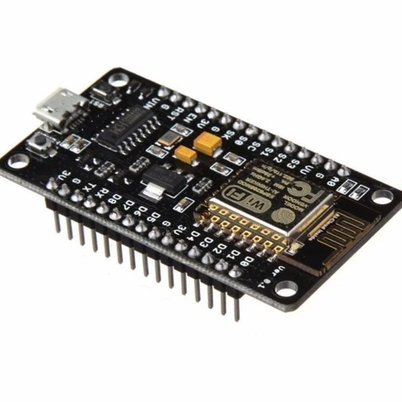
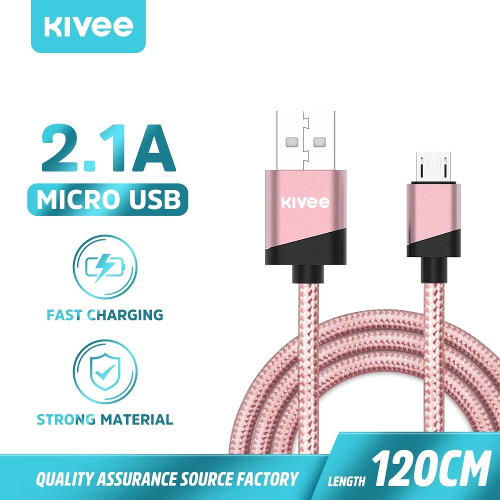

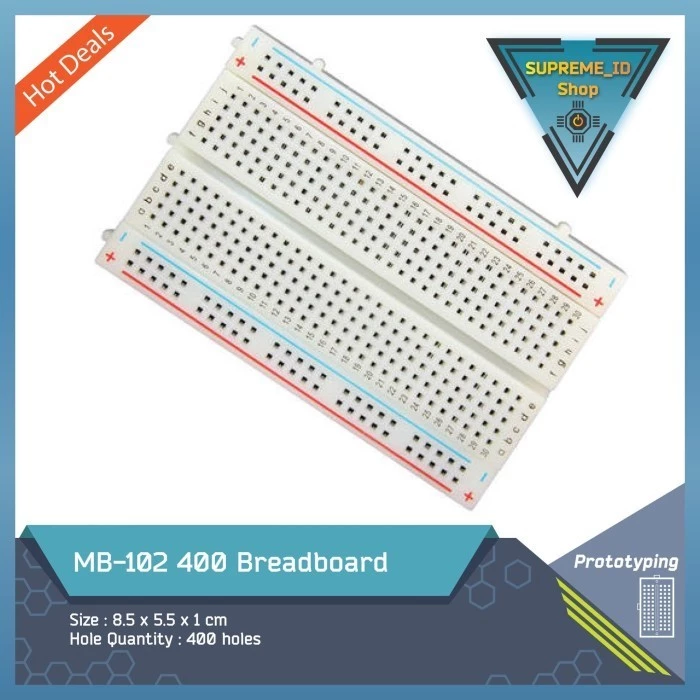
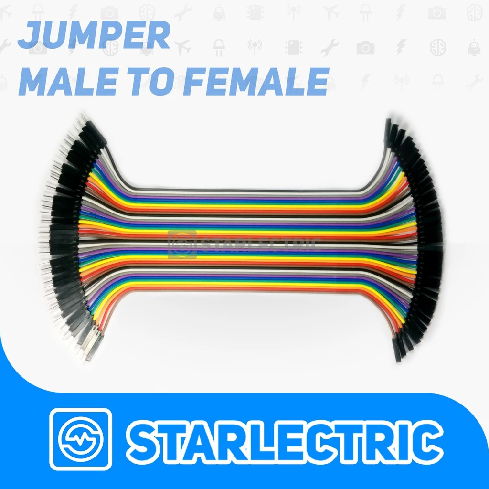
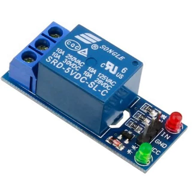
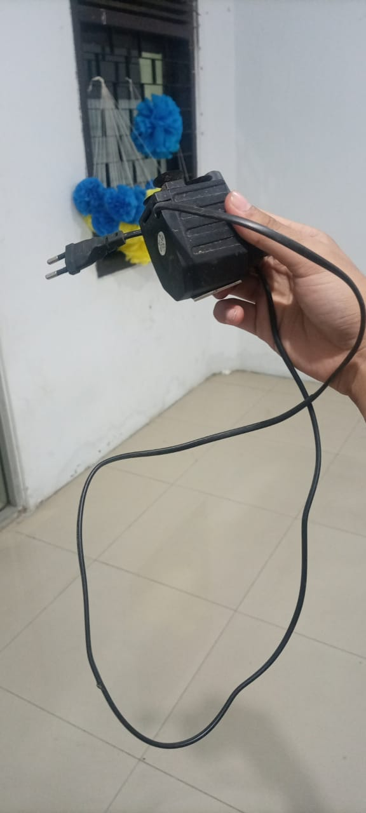
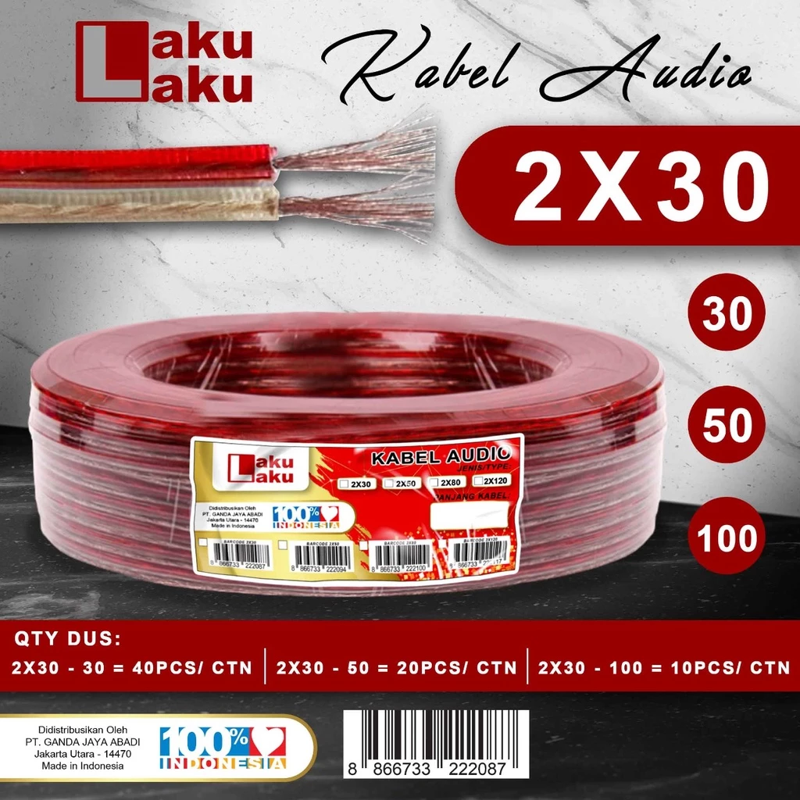
</div>


## Alur Pemasangan alat dan konfigurasi arduino

- Persiapkan module NodeMCU 8266. Pada project kali ini, kita hanya akan menggunakan satu sisi saja. Sisi yang digunakan adalah yang terdapat pin A0, Ground (G), 3V.

- Buat Rangkaian jumper cable seperti pada gambar, gunanya sebagai jalur pada rangkaian.
<div style="width:100%; display: flex; flex-wrap: wrap; justify-content: center; align-items: center; gap:15px;">


</div>

| Nama input/output pada node | Deskripsi                                                                |
|:----------------------------|:-------------------------------------------------------------------------|
| `A0`                        | merupakan input dari NodeMCU 8266                                        |
| `G `                        | merupakan Ground yang digunakan sebagai akhir dari perjalanan rangkaian. |
| `3V`                        | merupakan pin yang mnegalirkan tegangan 3V.                              |
| `D0`                        | mengirimkan sinyal dari sensor.                                          |

-  Saya menggunakan kawat untuk pengganti sensor kelembapannya.. anda bisa mengganti dengan sensor kelembapan supaya lebih akurat


-  Jika semua rangkaian sudah terpasang dengan benar. Buka aplikasi Arduino yang ada pada PC/Laptop kalian. Bagi yang belum mendownload software Arduino bisa di download pada link Aplikasi __[Arduino](https://docs.arduino.cc/software/ide-v2/tutorials/getting-started/ide-v2-downloading-and-installing/)__


- Configurasi Arduino IDE Pada Additional Boards Manager URLs isikan link berikut
```arduino
http://arduino.esp8266.com/stable/package_esp8266com_index.json
```

<div style="width:100%; display: flex; flex-wrap: wrap; justify-content: center; align-items: center; gap:15px;">

</div>


- Selanjutnya, pilih menu Tools > Board > Board Manager, maka akan muncul tampilan seperti gambar dibawah Lalu search “ESP8266” karena disini kita menggunakan NodeMCU ESP8266 dan install board tersebut.

<div style="width:100%; display: flex; flex-wrap: wrap; justify-content: center; align-items: center; gap:15px;">


</div>

- Selanjutnya, pasang kan module NodeMCU 8266 ke PC/Laptop menggunakan kabel micro usb.

<div style="width:100%; display: flex; flex-wrap: wrap; justify-content: center; align-items: center; gap:15px;">

</div>

- Selanjutnya pilih Board NodeMCU 1.0 pada tools > board.
<div style="width:100%; display: flex; flex-wrap: wrap; justify-content: center; align-items: center; gap:15px;">

</div>

- Selanjutnya pilih Board NodeMCU 1.0 pada tools > port. Sesuaikan dengan port USB yang anda colok ke laptop atau pc


## Alur Konfigurasi Blynk
Selanjutnya jika module sudah terprogram, maka skrg kita akan melakukan instalasi client side, atau tampilan untuk menggunakan nantinya.

- Buka Handphone kalian, lalu download Blynk di Google Playstore/Appstore atau bisa juga pada situ website __[Blynk](https://blynk.io/)__.

- Lalu login dan klik developer zone yang gambar icon obeng.
  
<div style="width:100%; display: flex; flex-wrap: wrap; justify-content: center; align-items: center; gap:15px;">
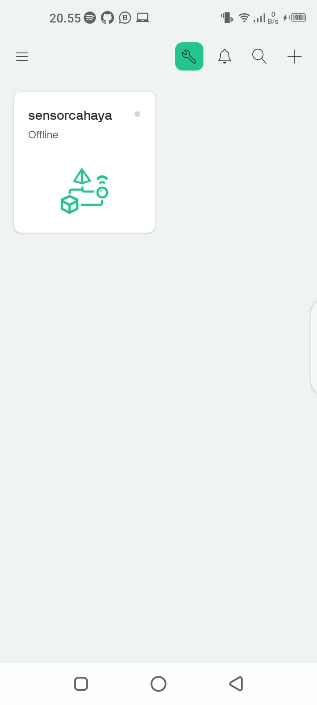
</div>

- Lalu Tambahkan new template yang ada icon + plus.
<div style="width:100%; display: flex; flex-wrap: wrap; justify-content: center; align-items: center; gap:15px;">
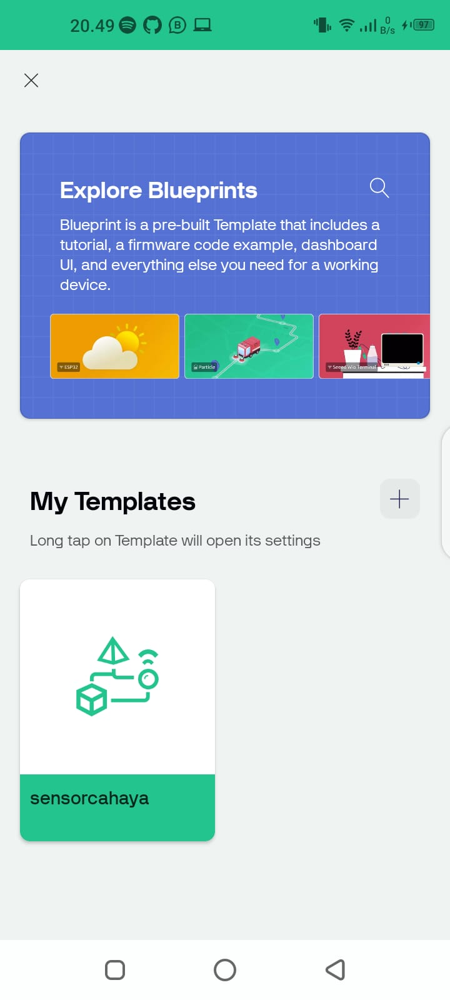
</div>

- Buat dan tambahkan beberapa widget ini yaitu tombol v1, tombol v3 dan gauge v2
<div style="width:100%; display: flex; flex-wrap: wrap; justify-content: center; align-items: center; gap:15px;">
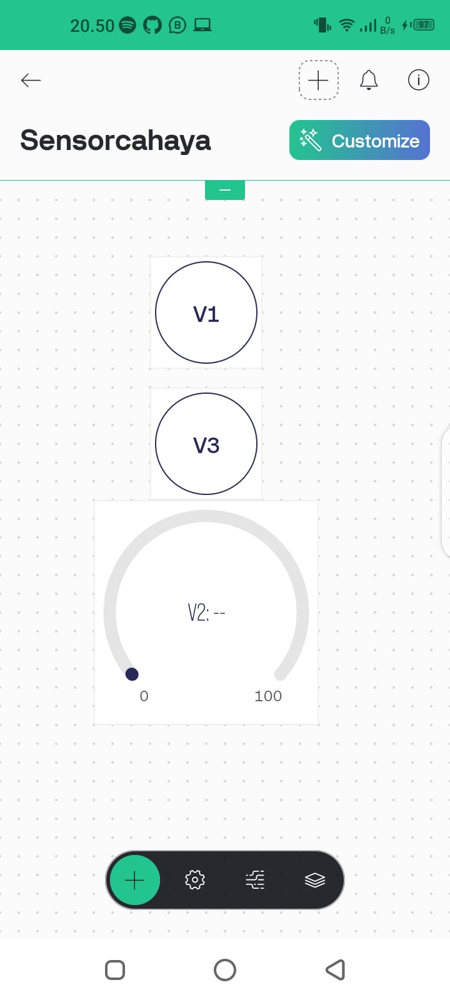
</div>

- Setting widget Button v1
  <div style="width:100%; display: flex; flex-wrap: wrap; justify-content: center; align-items: center; gap:15px;">
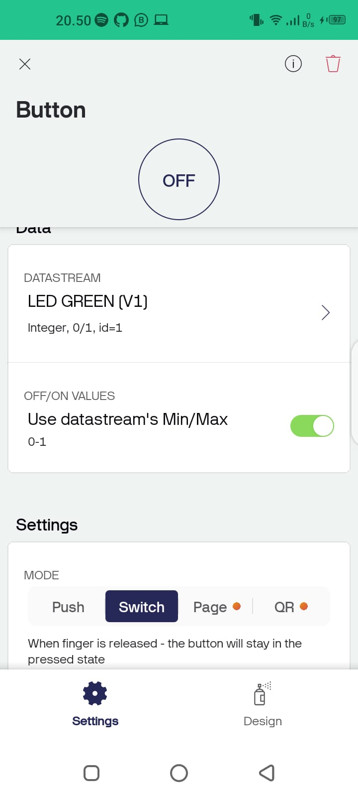
</div>


- Setting datastream untuk widget v1
  <div style="width:100%; display: flex; flex-wrap: wrap; justify-content: center; align-items: center; gap:15px;">
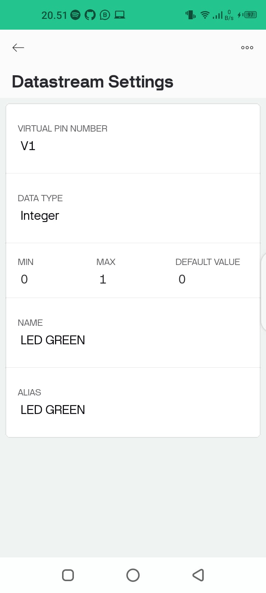
</div>


- Setting widget Button v3
  <div style="width:100%; display: flex; flex-wrap: wrap; justify-content: center; align-items: center; gap:15px;">
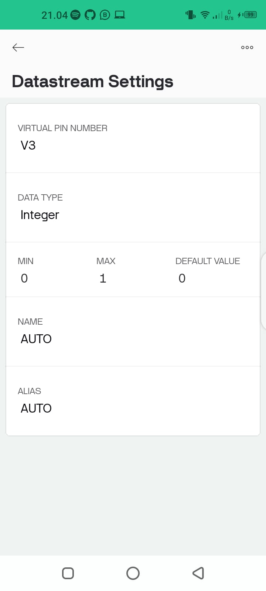
</div>


- Setting datastream untuk widget v3
  <div style="width:100%; display: flex; flex-wrap: wrap; justify-content: center; align-items: center; gap:15px;">
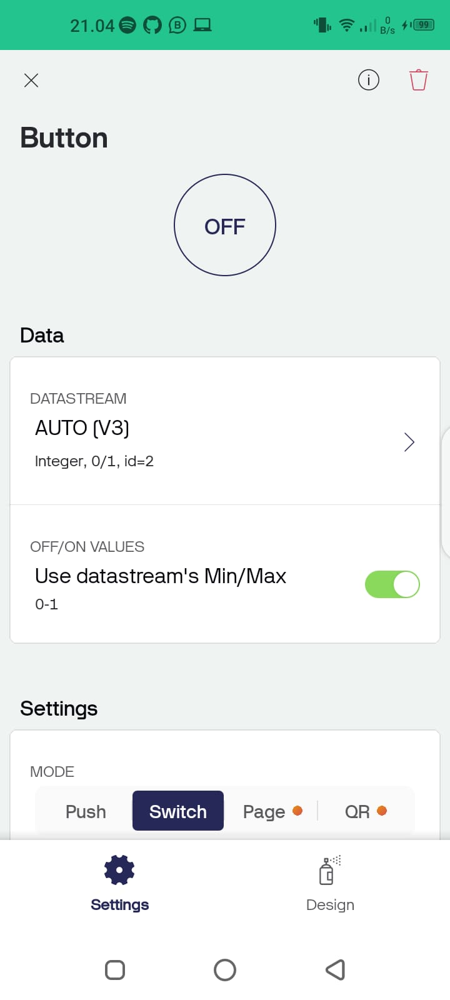
</div>


- Setting widget Gauge v2
  <div style="width:100%; display: flex; flex-wrap: wrap; justify-content: center; align-items: center; gap:15px;">
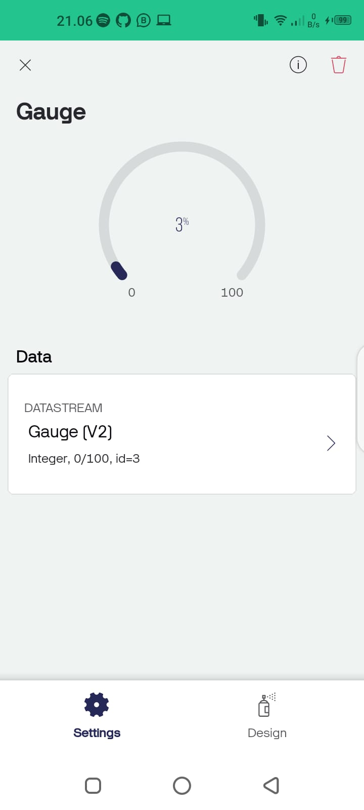
</div>


- Setting datastream untuk widget v2
  <div style="width:100%; display: flex; flex-wrap: wrap; justify-content: center; align-items: center; gap:15px;">
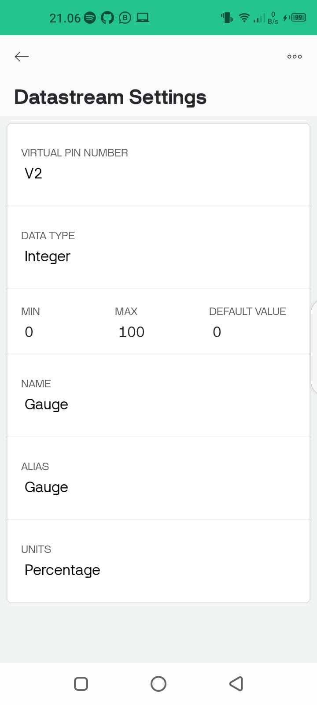
</div>


## Authors

- [Bpk Dosen Ridwan Mochamad](https://github.com/mridwanhi)
- [Adam setiadi](https://github.com/madamroger007)


## Referensi

 - [Medium](https://medium.com/@agamtheos/model-lampu-nyala-hidup-otomatis-menggunakan-sensor-cahaya-nodemcu8266-blynk-2cf7a3cd589a)
 - [Blynk Example](https://examples.blynk.cc/)
